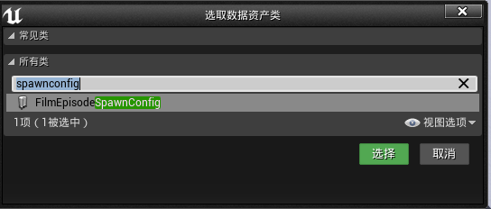

# Film Making Internal

影片生成器内部版


## 目录

* [Film Making Internal](#film-making-internal)
  * [目录](#目录)
  * [更新日志](#更新日志)
  * [【入门】](#入门)
    * [1\. 安装到项目工程](#1-安装到项目工程)
    * [2\. 确认插件已启用](#2-确认插件已启用)
    * [3\. 查看示例](#3-查看示例)
    * [一、镜头生成](#一镜头生成)
      * [1\. 创建影片文件夹](#1-创建影片文件夹)
      * [2\. [必要] 创建通用生成配置](#2-必要-创建通用生成配置)
      * [3\. [必要] 创建影片剧集](#3-必要-创建影片剧集)
      * [4\. [必要] 创建镜头规划数据表](#4-必要-创建镜头规划数据表)
      * [5\. [必要] 创建镜头生成器](#5-必要-创建镜头生成器)
      * [6\. [可选] 从外部导入镜头规划表](#6-可选-从外部导入镜头规划表)
      * [7\. [必要] 生成镜头](#7-必要-生成镜头)
      * [8\. [可选] 打开并开始编辑镜头](#8-可选-打开并开始编辑镜头)
    * [二、镜头合并](#二镜头合并)
      * [1\. 创建剧集资产](#1-创建剧集资产)
      * [2\. 加载镜头](#2-加载镜头)
      * [3\. 合并镜头](#3-合并镜头)
  * [【使用规范】](#使用规范)
    * [一、名词解释](#一名词解释)
      * [资产架构图解](#资产架构图解)
      * [名词解释](#名词解释)
    * [二、生成问题](#二生成问题)
      * [SQ1：合并镜头时引擎崩了是为什么？](#sq1合并镜头时引擎崩了是为什么)
      * [SQ2：如何设置影片帧率？](#sq2如何设置影片帧率)
    * [三、制作问题](#三制作问题)
      * [MQ1：我要制作镜头里的内容该如何开始？](#mq1我要制作镜头里的内容该如何开始)
      * [MQ2：我在什么时候需要增加子关卡？](#mq2我在什么时候需要增加子关卡)
      * [MQ3：我的镜头专用场景现在要被其他镜头使用怎么让他们共用？](#mq3我的镜头专用场景现在要被其他镜头使用怎么让他们共用)
      * [MQ4：我的镜头里现在使用的是通用场景现在要针对这个镜头修改应该怎么办？](#mq4我的镜头里现在使用的是通用场景现在要针对这个镜头修改应该怎么办)
  * [【操作速查】](#操作速查)
    * [▷ 增](#-增)
      * [增加镜头](#增加镜头)
      * [创建子关卡及给镜头主关卡增加子关卡](#创建子关卡及给镜头主关卡增加子关卡)
      * [影片通用资产](#影片通用资产)
    * [▷ 删](#-删)
      * [删除子关卡](#删除子关卡)
    * [▷ 改](#-改)
      * [改变镜头顺序](#改变镜头顺序)
    * [▷ 查](#-查)
      * [查看剧集](#查看剧集)
      * [查看镜头](#查看镜头)


## 更新日志

**最新正式版本号**

	"Version": 2,
	"VersionName": "1.1.a",
	"EngineVersion":"4.26.0",
	"Date": "2021/10/11",
	"DocsUpdate": "2021/10/12",
	"DocsURL": "https://github.com/BadFishy/FilmMakingInternalDoc",
	"InternalSVNUrl": "https://server-2008/svn/Program-CreatEngine/Plugins/Release/FilmMakingInternal_Release_4.26"

**程序更新日志**

```
- 2021/10/11 Release_1.1.a
	修复新建通用天气时的写入错误
```

**文档更新日志**

```
- 2021/10/13
	优化排版
	新增使用规范包括常见问题
	程序更新日志新增对应的正式版本号
	
- 2021/10/12
	新增程序更新日志和文档更新日志
	新增镜头合并相关入门
	新增操作速查，包含增删改查的分类
	优化标题排版
	更新正式版本号
```

---


## 【入门】


### 1. 安装到项目工程

将`FilmMakingInternal`文件夹放置到`虚幻引擎的工程`的工程目录下的`Plugins`文件夹下即可


### 2. 确认插件已启用

打开已经安装 `FilmMakingInternal` 的项目工程，点击左上角的`编辑 - 插件`往下面翻到`项目 - CreatEngine`，即可看到本插件，确保是已启用状态。


### 3. 查看示例

如果你不想阅读本教程，想快速开始，可以直接参考插件提供的示例文件。

确保内容浏览器中的`显示插件内容`已开启，可以在内容浏览器的右下角`视图选项`中开始


### 一、镜头生成

让我们现在从头开始创建一个影片吧！

#### 1. 创建影片文件夹

我们的影片可不能直接放在项目的根目录，这会导致在导入其他资产或把我们的影片导入到其他工程时找不到哪些是我们影片自己的资产。

这里，我创建了一个名为`ToyStory`的文件夹，这是我们的片名。注意，你取文件夹名时，一定要使用英文字母，且首字母需要大写，不能包含空格，最好不要包含`_`等字符。

在`ToyStory`下，我还创建了3个文件夹，分别是：

```
ToyStory
 - Common 这是我们影片中的通用资产，比如大场景、天气、角色、道具，它可能会被多个镜头引用。
 - Episode 这是剧集，这是我们影片的镜头实际存放的目录。如果影片有很多集，那么这个文件名可以叫做 Episode1st/Episode2nd... 
 - Spawner 这是生成器，我们的重头戏，其实它只用在创建新镜头时使用~
```


#### 2. [必要] 创建`通用生成配置`

> *通用生成配置* : 是用来配置本集影片多个镜头会用到的场景、天气、角色、道具，等资产的数据资产。

首先在我们刚刚创建的`Common`中点击右键`选择`其他 - 数据资产`

找到`FilmEpisodeSpawnConfig`，并`选择`，来创建，起名为`FESC_ToyStory`



命名规范推荐是使用 `FSEC_`作为前缀，后面写你的影片名，这个是只在本影片通用的资产配置。


#### 3. [必要] 创建`影片剧集`

> *剧集* : 一个剧集即代表一集影片，剧集资产里储存了影片的一些基本参数（如帧率），并引用了本集影片中的所有镜头信息。

在我们刚刚创建的`Episode`中点击右键`选择`其他 - 数据资产`

找到`FilmEpisode，并`选择`，来创建，起名为`FE_ToyStory`


双击点击`FE_ToyStory`，以打开其细节面板

可以对其进行配置，类似这样

*由于版本更新的原因，这个界面可能会有变化*


#### 4. [必要] 创建`镜头规划数据表`

在我们刚刚创建的`Spawner`中点击右键`选择`其他 - 数据表格`

找到`InputShotInfo，并`确定`，来创建，起名为`ISI_ToyStory`


然后双击打开刚刚创建的`ISI_ToyStory` ，使用添加即可添加新镜头。


需要注意的是，行命名请保持默认。镜头序号从1开始，按顺序填不能重复的整数。

填写出来后类似于这样


#### 5. [必要] 创建`镜头生成器`

在我们刚刚创建的`Spawner`中点击右键`选择`其他 - 数据资产`

找到`FilmEpisodeSpawnHelper，并`选择`，来创建，起名为`FES_ToyStory`


打开`FES_ToyStory`，可以看到3类配置


剧集配置选择刚刚创建的`FE_`前缀的后缀名是自己影片的影片剧集资产

镜头规划数据选择`ISI_`前缀的数据表格

生成器配置，可以使用加号添加元素，第 0 项必须是本影片的通用配置。第 1 项起可以添加其他的通用配置，比如很多不同片子都能通用的场景、天气就可以预设到这个通用配置中。

``` 
生成器配置的主要作用是，使用镜头规划数据表中填写的（如场景天气道具等）名称在生成器配置中进行查找。如镜头规划数据表中，天气填写的“晴天”，那么在生成镜头时，就会从生成器配置的第0项开始，查找“晴天”对应的关卡，以加入到镜头的关卡中，如果第0项没有找到，再往后查找。如果都没找到，那么将在第0项生成器通用配置的目录下自动生成对应的关卡，后续制作者直接在对应的关卡中创作，即可自动加载到镜头中。
```


#### 6. [可选] 从外部导入镜头规划表

目前推荐使用腾讯文档进行编辑

[腾讯文档] 镜头规划表-模板：
https://docs.qq.com/sheet/DWndMVlBXWlNxSWNy

详细使用方法还待完善

#### 7. [必要] 生成`镜头`

前提条件：已完成以上所有必要步骤

打开`FES_ToyStory`，点击`SpawnShotAssets`即可一键生成。

每个镜头与空场景大概需要生成1.5秒，如果引用的场景或者天气比较复杂，可能需要更长时间。

当屏幕中间有窗口在快速闪动时，则是正在生成。

生成完成后屏幕中间的弹窗消失，此时已经生成完毕。在`Episode/Shots`下，即是我们的镜头。


#### 8. [可选] 打开并开始编辑镜头

认识一下，这是镜头

> *镜头* : 镜头资产里存储了这个镜头的关卡和关卡序列，同时还存储了需要流送的子关卡列表，以便后续合并镜头时加载正确。

打开镜头目录`Shots`下的`Shot001`/`FS_Shot001`，这个就是记录这个镜头信息的资产。要打开开始编辑这个镜头，请先双击`镜头主关卡`，打开关卡成功后，再双击`镜头主关卡序列`，这样就可以做动画了~


### 二、镜头合并

一键合并镜头，实时快速拉片！

#### 1. 创建剧集资产

> > *剧集资产* : 包括剧集关卡和剧集关卡序列。
>

首先打开影片剧集资产，一般是`FE_`作为前缀，路径名为`影片名\Episode\FE_****`

可以看到，`剧集关卡`和`剧集关卡序列`为空。点击`New Episode Assets` ，即可自动创建


确定`剧集关卡`和`剧集关卡序列`不为空后进行接下来的操作。

#### 2. 加载镜头

点击`Load Shots`即可刷新加载镜头

*后续这个操作会被优化自动处理，但是现在，还是点一下吧*

#### 3. 合并镜头

点击`ExecuteMerger`即可合并镜头

根据镜头数量，此操作可能会等待一会儿，直到弹窗消失即完成~


## 【使用规范】

### 一、总览

#### 资产架构图解


#### 名词解释

@todo: 正在编写

| 中文名词     | 程序类词               | 对象前缀 | 解释                                                         |
| ------------ | ---------------------- | -------- | ------------------------------------------------------------ |
| 通用生成配置 | FilmEpisodeSpawnConfig | FESC     | 是用来配置本集影片多个镜头会用到的场景、天气、角色、道具，等资产的数据资产。 |
| 剧集         | FilmEpisode            | FE       | 一个剧集即代表一集影片，剧集资产里储存了影片的一些基本参数（如帧率），并引用了本集影片中的所有镜头信息。 |
|              | Actor                  |          |                                                              |


### 二、生成问题

#### SQ1：合并镜头时引擎崩了是为什么？

SA1：请保证`剧集资产（FE）`里的剧集关卡和剧集关卡序列存在，在生成前其最好为空。如果不存在请参考 [1\. 创建剧集资产](#1-创建剧集资产)。

*@TODO: 程序增加自动清理剧集关卡和剧集关卡序列功能*


#### SQ2：如何设置影片帧率？

SA1：目前不能在镜头已经生成后修改影片帧率。如果是在镜头生成前，可以在`剧集资产（FE）`里修改。生成时会自动使用里面的帧率。

*@TODO: 程序增加批量修改镜头帧率功能*


### 三、制作问题

#### MQ1：我要制作镜头里的内容该如何开始？

MA1：引擎打开项目后，首先在内容浏览器找到自己制作的影片名的文件夹（项目经理会告诉你），然后打开其目录下的`Episode(剧集)`文件夹，不出意外的话里面会有叫做`Shots`的文件夹，打开后里面就是这部剧集的所有镜头。前缀`Shot`后缀的数字就是镜头号。

​			打开要制作的镜头文件夹后，打开`FS_Shot[镜头号]`的资产，在弹出的细节面板先打开`镜头主关卡`再打开`镜头主关卡序列`即可编辑制作动画。如果只进行地编可以不打卡`镜头主关卡序列`。

​			打开`镜头主关卡`后，必须要打开`窗口 - 关卡`面板，可以把面板拖拽到编辑器中附着。`关卡`面板中蓝色名字的子关卡就是当前正在编辑的子关卡。请务必注意不要把Actor摆放到错误的子关卡。

​			图中红框内是值得注意的点


#### MQ2：我在什么时候需要增加子关卡？

MA2：① 在需要创建新的通用场景/通用天气时。

​			② *@TODO: 待补充，有需要可以咨询技术人员*

如何创建新的子关卡请参考 [创建子关卡及给镜头主关卡增加子关卡](#创建子关卡及给镜头主关卡增加子关卡)


#### MQ3：我的镜头专用场景现在要被其他镜头使用怎么让他们共用？

MA3：需要新建子关卡。流程如下：

​			① 首先确定需要被共用的`Actor` 和不需要被共用的`Actor`，可以把他们区分到不同的文件夹。以防不小心将镜头专用`Actor`被导出到新建的通用场景；

​			② 按照 [创建子关卡及给镜头主关卡增加子关卡](#创建子关卡及给镜头主关卡增加子关卡) 的步骤创建子关卡；

​			③ 在`世界大纲视图`选择需要导出到通用场景的`Actor`，选择好后在`关卡`窗口右键点击要被导入的通用场景的子关卡，选择`将选中的Actor移动到关卡中`。

​			④ 点击编辑器的`保存所有`即可。


#### MQ4：我的镜头里现在使用的是通用场景现在要针对这个镜头修改应该怎么办？

原本使用的是通用场景/天气，现在想针对这个镜头增加一些细节，比如原本通用场景的建筑是低模，现在要用高模；

MA4：这种情况建议依旧保留使用这个通用场景，然后在镜头关卡序列中引用低模建筑，对其设置为隐藏。然后再在当前镜头的 `Item 子关卡`或是 `Light 子关卡`（这取决于你是场景还是天气）中摆放高模。如果是单纯的隐藏某些`Actor`也可以用这个方法。


## 【操作速查】

### ▷ 增

#### 增加镜头

当前增加镜头的方式是，把镜头规划数据表清空，只填写需要增加的镜头，然后按照`生成镜头`的步骤即可。

#### 创建子关卡及给镜头主关卡增加子关卡

首先打开`关卡`窗口，如果没有打开可以在左上角的`窗口 - 关卡`打开。


然后确保已经打开当前镜头的主关卡和主关卡序列


如果需要添加的子关卡是这个镜头特有的，请到当前镜头目录的`ChildMaps`新建关卡，前缀一点要和当前镜头主关卡一样！

如果需要添加的子关卡是多镜头共用，而且只在剧集中使用，请新建关卡在剧集名所在的目录的`Common`目录的对应位置中

如果已经创过关卡了，直接进行下面的步骤

根据子关卡的类型不同，将子关卡的资产直接拖到`关卡`窗口中对应的文件夹


然后将`关卡`窗口中新出现的子关卡，拖动到当前镜头的`关卡序列`的`关卡可见性`中


然后点保存所有即可。（一点要保存啊！）

#### 影片通用资产


### ▷ 删

#### 删除子关卡

直接打开主关卡，然后在`关卡`窗口删除对应的子关卡即可，删除后记得保存。

*如果主关卡没有进行除了删除子关卡以外的操作，那么它不会被标记为待保存，那么最好随便改动一下里面的 Actor 的属性，再点保存。这是虚幻引擎的BUG*


### ▷ 改

#### 改变镜头顺序

暂时还不支持


### ▷ 查

#### 查看剧集

打开影片名目录下的`Episode`文件夹里的 `FE_`前缀的`影片剧集资产`即可。

如果已经进行过合并，在里面先打开`剧集关卡`，再打开`剧集关卡序列`，即可查看当前剧集。

@TODO： 后续可以实现直接双击`影片剧集资产`即自动打开对应的`剧集关卡`和`剧集关卡序列`

#### 查看镜头

打开影片名目录下的`Episode`文件夹里的`Shots` 目录里需要查看的镜头号的`FS_`前缀的`镜头资产`即可。

在里面先打开`镜头主关卡`，再打开`镜头主关卡序列`，即可查看当前镜头。
